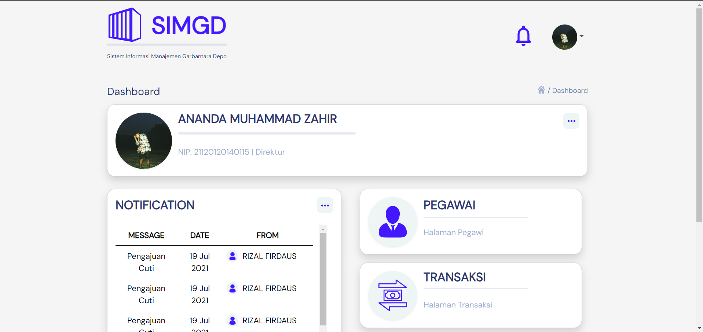

# FRONT-END SIMGD LOGIN + DASHBOARD

## How To Use It

1. Download this or clone the repo

```bash
git clone https://github.com/amiftachulh/car-rent.git
```

2. Install Depedency

```bash
npm install
```

3. Run Project

```bash
npm run dev
```

## Demo

###Login Page###


###Dashboard###


# INI BELUM FIX YA

> **Yg Kurang**
>
> 1.  Blm Responsive
> 2.  Logo aslinya blm ada
> 3.  Font ama warnya masih bawaan bootstrap
> 4.  Masih make bootstrap + vite
> 5.  Design Figma nya blm ada
